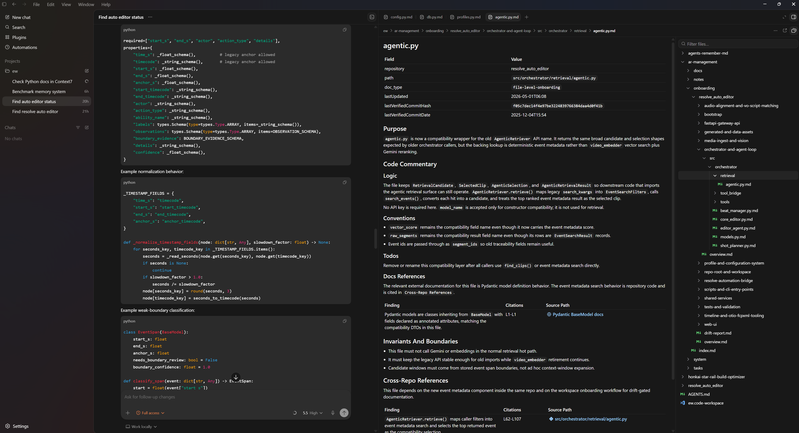

# Agents Remember

_"My agent keeps forgetting everything. So I made it write notes to its future self."_

Modern coding agents look superhuman one moment, then hit you with a divine stroke of idiocy the next.

On a small task, an `AGENTS.md` file, a few prompt rules, and a strong model can feel almost magical. That creates the illusion that the agent already “knows the codebase.” **In larger systems, that illusion breaks.** The agent does not actually know your architecture, your hidden invariants, your migration scars, or the strange rules everyone on the team has learned the hard way. It only knows what the repository makes legible.

That is why the failures are so weird. The output looks plausible. The edit is clean. **The regression is real.**

A single top-level instruction file can point the agent in the right direction, but it cannot reappear exactly when the agent needs it. **Once the agent is deep in a file, the relevant context is no longer naturally in front of it.** Recovering it becomes an explicit search problem: expensive, uncertain, and easy to skip.

It is like handing someone a city map at the train station and taking it away before they start walking. The problem is not that they never saw the map. The problem is that it is gone when they need it on the next turn.

That's where Agents Remember's simple premise starts: important project knowledge should not have to be hunted down. If it is not local, structured, and discoverable, **then for the agent it effectively does not exist.**

So the way forward is to make that missing context visible before the agent has to guess.

## What This Looks Like

An agent touches:

```text
resolve_auto_editor/src/orchestrator/core_editor.py
```

In the default local mode, it checks the repo-local onboarding unit:

```text
resolve_auto_editor/ar-management/onboarding/src/orchestrator/core_editor.py.md
```

Before trusting that file, it runs drift detection:

```text
core_editor.py.md       drifted      source changed since 4d1fdf2
shot_planner.py.md      drifted      source changed since 4d1fdf2
22 other files          up to date
```

Then it refreshes only the stale onboarding and plans against current context, not old notes.



---

## Why I made this repo

Imagine you work in a multi-repo product workspace. Configurator, firmware, user & device management, cloud services, etc. All of it revolving around one product. And some of the code has been growing for decades.

That is exactly the kind of environment where agents struggle. A small issue is fine. But for migrations or cross-repo changes, the important knowledge is rarely in one file. It is spread across repos, conventions, old decisions, and domain-specific quirks. Asking an agent to rediscover all of that from scratch every time either blows up the context window or produces shallow answers.

The idea came from our embedded code. Many files had large comment sections at the top: who changed what, when, and what strange behavior mattered. At first that looked excessive. But as I browsed, I realized those comments let me understand code I had never worked in before. I could read some, sure, but the commentary gave me the shape of the system much faster than code alone would have.

I wanted that same effect for developers working with agents. But I did not want to force extra commentary into source files for teams that prefer to keep code surfaces clean, and I did not want the knowledge layer to drift without explicit verification. So the first version of this repo kept the extended commentary separate and deterministic: one mirrored markdown onboarding unit per source file.

The local sidecar file is the default, but it is not the whole idea. The real trick is not markdown for its own sake. The trick is 1-to-1 onboarding. If an agent is working on `src/foo/bar.ts`, it should know exactly where the onboarding unit lives and how to verify it. In the default internal setup that means `ar-management/onboarding/src/foo/bar.ts.md` inside the target repo. In inline storage that means the structured onboarding block inside `src/foo/bar.ts` itself. No secret wiki, no guessing, no giant context dump. The agent can onboard itself from the file it is touching and discover the hidden contracts around it naturally.

That is what this repository is trying to make practical: a collaborative knowledge layer that grows as work happens. Documentation stops being a second job and becomes a trail of useful context left behind by real tasks.

The onboarding units are a shared knowledge substrate. Versioned in git, readable by people, and easy for agents to retrieve. That transfer of knowledge between developers, tools, and future sessions is the heart of this project.

---

## Techstack

```text
Skills for Claude Code, Cursor, VS Code, and similar tools. No software dependencies.
Just markdown files and conventions.
```

---

## Quickstart

Clone this repository somewhere next to your existing code. The default setup keeps memory artifacts inside the repository you are onboarding, under that repository's own `ar-management/` folder:

```text
projects/
  AGENTS.md                   ← workspace AGENTS.md
  agents-remember-md/         ← this repo
    AGENTS.md
  my-app/                     ← your existing repo
    src/
    ar-management/            ← created by C-00 for this repo
      onboarding/
      tasks/
      docs/
      notes/
      system/
        settings.md
        sources.md
        tools.md
```

---

### Create The Local Management Folder

Initialize the target repository with `C-00-initialize-management-root`. This first-run skill defaults to internal topology, creates only the target repo's local `ar-management/` folder, and writes starter `settings.md`, `sources.md`, and `tools.md` files without overwriting existing files.

The resulting scaffold looks like this:

```text
ar-management/
├── onboarding/
├── tasks/
├── docs/
├── notes/
└── system/
    ├── settings.md
    ├── sources.md
    └── tools.md
```

`C-00` intentionally leaves `onboarding/` empty; `C-03-repo-bootstrap` owns repo onboarding below that point. The starter `system/settings.md` controls topology, storage, and `pathRules`. The starter `system/sources.md` and `system/tools.md` are intentionally plain; fill them in with project-specific docs, commands, and checks as repos are onboarded.

---

### Storage And Path Eligibility

Agents Remember treats file-level onboarding as an onboarding unit. The unit can be stored as a repo-local sidecar markdown file, or as an inline block inside the source file when a repo explicitly selects inline storage.

Storage choice and path eligibility are different concerns:

- `onboarding.storage` decides where eligible onboarding artifacts live.
- `onboarding.pathRules` decides which source paths and file types are eligible for onboarding.

Default internal storage is `repo-sidecar`, which stores onboarding directly under the target repository's `ar-management/onboarding/` folder using source-relative paths.

Repo-level architecture context stays in `ar-management/onboarding/overview.md`. If a repo needs deeper coverage beyond the first overview pass, extend that same overview by merging the new area findings into the relevant existing sections so it remains one coherent document instead of growing a permanent `ar-management/onboarding/<component>/overview.md` layer.

`pathRules` exist in both internal and shared settings. They include or exclude paths and file types; they do not switch storage per path. In repo-local internal settings, an unscoped rule applies to that repository. In shared settings, scope rules with `path: <repo-name>` so each shared-managed repository can have its own eligibility rules. Leave a rule unscoped only when you intentionally want the same eligibility default for every shared-managed repository.

```yaml
management:
  topology: internal

onboarding:
  storage:
    mode: repo-sidecar
  pathRules:
    include:
      paths:
        - README.md
        - docs/**
        - src/**
      fileTypes:
        - .md
        - .py
        - .ts
        - .tsx
    exclude:
      paths:
        - vendor/**
        - node_modules/**
        - dist/**
      fileTypes:
        - .png
        - .zip
```

Inline onboarding reuses the same file-level onboarding content model as sidecar onboarding. Only storage, comment syntax, placement, parsing, digesting, and fallback behavior differ.

---

### Wire Up Your Agent

The steps are the same regardless of which tool you use:

1. Wire up the agent so it reads `AGENTS.md` from this repo at session start (tool-specific instructions below).
2. Run `C-00-initialize-management-root` for the target repo if its local `ar-management` scaffold does not exist yet.
3. Run `C-03-repo-bootstrap` to scaffold the initial onboarding structure under `<target-repo>/ar-management/onboarding/`. A bare repo-level `overview.md` is enough; deeper area sections are folded back into that same file as the repo is explored.
4. Start using the agent normally. Chat handles most tasks. The agent reads the resolved onboarding unit alongside the source file and updates it as it goes.
5. Escalate to `W-02-light-task-workflow` or `W-01-heavy-task-workflow` when the task needs a written plan or needs to survive beyond a single session.

Coverage builds from real work. The first task on a file usually creates or refreshes its onboarding unit; every task after benefits from that local context.

---

### Codex

Add a `AGENTS.md` at the root of your projects folder:

```markdown
# Workspace Agent Instructions

Read and follow `agents-remember-md/AGENTS.md` before working in any sibling project.
Treat these rules as workspace instructions!

@agents-remember-md/AGENTS.md
```

---

### Claude Code

Add a `CLAUDE.md` at the root of your projects folder:

```markdown
# Workspace Agent Instructions

Read and follow `agents-remember-md/AGENTS.md` before working in any sibling project.
Treat these rules as workspace instructions!

@agents-remember-md/AGENTS.md
```

Claude Code imports the file into context at session start. When a skill applies, the agent reads the corresponding `SKILL.md` using its normal file tools — no extra configuration needed since `agents-remember-md` is already accessible on disk.

---

### Cursor

Create `.cursor/rules/agents-remember.mdc` in your projects folder:

```markdown
---
description: Agents Remember memory system conventions
alwaysApply: true
---

Read and follow `agents-remember-md/AGENTS.md` before working in any sibling project.
Treat these rules as workspace instructions!

@agents-remember-md/AGENTS.md
```

Alternatively, use Cursor's built-in GitHub import to sync rules directly from this repo. Skills are read on demand by the agent using standard file access.

---

### VS Code + GitHub Copilot

Open (or create) a `.code-workspace` file that includes both repositories as folders. Copilot needs the skills directories listed explicitly in `chat.agentSkillsLocations` — without this setting it won't discover them:

```json
{
  "folders": [{ "path": "agents-remember-md" }, { "path": "my-app" }],
  "settings": {
    "chat.agentSkillsLocations": {
      "agents-remember-md/skills": true,
      "agents-remember-md/skills/U-01-core-skills": true,
      "agents-remember-md/skills/W-01-heavy-task-workflow": true,
      "agents-remember-md/skills/W-02-light-task-workflow": true,
      "agents-remember-md/skills/P-00-creation": true,
      "agents-remember-md/skills/P-01-research": true,
      "agents-remember-md/skills/P-02-synthesis": true,
      "agents-remember-md/skills/P-03-design": true,
      "agents-remember-md/skills/P-04-planning": true,
      "agents-remember-md/skills/P-05-implementation": true,
      "agents-remember-md/skills/P-06-closing": true,
      "agents-remember-md/skills/P-99-review": true
    }
  }
}
```

You can add a `.github/copilot-instructions.md` in the code repo to layer on any repo-specific overrides.

---

### Windsurf

Add both repositories to your workspace. Windsurf automatically discovers `AGENTS.md` files within the workspace tree and reads skills on demand from there. You can add repo-specific additions in `.windsurf/rules/*.md` inside the code repo if needed.

---

## The three modes

Most tasks don't need a framework. They need an agent that already knows the codebase. That's what the memory layer provides, and that's why the default mode is just **chat**.

| Mode               | When                                                                                                      | What the agent does                                                                                                                                                                             |
| ------------------ | --------------------------------------------------------------------------------------------------------- | ----------------------------------------------------------------------------------------------------------------------------------------------------------------------------------------------- |
| **Chat** (default) | Simple tasks that fit in one session                                                                      | Reads onboarding alongside code, proposes changes with code examples in chat, implements on approval, updates onboarding                                                                        |
| **Light task**     | Medium tasks, or tasks likely to outlive one session                                                      | Writes a single-page plan to a task file, gets approval, implements, updates onboarding                                                                                                         |
| **Heavy task**     | Migrations, cross-repo contracts, changes where "looks right, breaks in production" would be catastrophic | Seven phases with review gates and adversarial checkpoints, projected code+intent before touching real code, task-local docs that promote into onboarding only after implementation is approved |

All three modes share the same three-part discipline:

1. **Drift check before planning.** Before the agent plans against onboarding, it verifies that the resolved onboarding unit is not stale against the source. The `C-02-onboarding-drift-detection` skill runs this check and classifies trust.
2. **Approval before implementation.** The agent proposes changes. The developer approves. No implicit approval, no "I'll just make this small edit."
3. **Onboarding update after approved changes.** Onboarding reflects approved code, not speculation. The update happens after the developer approves the change, not before.

The drift check establishes a start-of-task baseline for pre-existing files. It does not mean the agent must refuse to read files it just created or dirtied during the current task; those are task-local working state and stay pending verification until the next verification pass.

The modes differ in _how approval happens_ — a chat turn, a task file review, a phase-gate checkpoint — not in what the discipline is. One system at three resolutions.

In chat mode, the whole loop is small enough to state in full. It lives in `AGENTS.md` and reads:

```markdown
1. When planning code changes against onboarding documentation, invoke
   `C-02-onboarding-drift-detection` to find drifted onboardings for the
   pre-existing files in question. Do not plan against drifted or
   missing-verification onboarding until the drift report has been handed off
   to `C-05-create-or-update-onboarding-files` or the caller has explicitly
   accepted directional-only trust. This establishes a start-of-task baseline;
   it does not re-trigger solely because the current task later creates or
   modifies files in that scope.

2. Once planned, show the changes to the developer in chat including
   code examples for every distinct change you intend to make. Wait for
   explicit developer approval before changing any code.

3. After approval, apply the code changes, update the onboarding
   documentation, and use the appropriate code quality checks from
   `<resolved-root>/system/tools.md`.
```

No task folder, no phase structure. The same discipline the heavier modes enforce through artifacts is carried by chat turns.

---

## What makes the memory layer honest

Memory systems fail in two ways. They go stale (the code moves, the docs don't). They get polluted with speculation (an agent writes what it _planned_ to build, not what exists). This system addresses both:

**Staleness.** Each onboarding unit records verification metadata appropriate to its storage mode. Sidecar onboarding records the source file's verified git commit. Inline onboarding records a source digest computed from the file body with the onboarding block removed. Before any planning work, the agent resolves where onboarding lives, checks that metadata against the current source, and refreshes stale onboarding before planning against it. This is `C-02-onboarding-drift-detection`, and it runs as the first step of every mode.

**Pollution.** The approval gate is global: no unapproved work goes into onboarding. In chat mode, the gate is the developer's approval turn. In light task, it's approval of the plan and of the implementation. In heavy task, it's the promotion step at Closure after CP5 passes. Task-local artifacts — input documentation, projected outputs, implementation plans — stay task-local until implementation is approved. Only then does anything reach the canonical onboarding tree.

Both guarantees hold across all three modes. The memory layer only accepts validated history, the same discipline git applies to `main`.

---

## Repository bootstrapping

Onboarding does not need to be fully present before you can use the system. A repo with no onboarding can start with a bare `overview.md` and be scaffolded by using the `C-03-repo-bootstrap` skill. From there it can grow organically as tasks touch new areas. The first task on a file pays the cost of creating or refreshing that file's onboarding unit; every task after that benefits.

For bulk coverage the `C-03-repo-bootstrap` skill can do more. After `overview.md` you can scaffold an entire repo in phases. Start with the hotspots and then go into detail where needed. You can bootstrap hundreds of files in a session, which is nowadays practical on current models using sub-Agents and parallelism.

---

## Advanced: Shared Management Roots

Most users should start with repo-local internal management. Shared mode is for teams that intentionally want one management root for selected repositories.

In shared mode, create or choose a shared `ar-management/` root and configure `AR_MANAGEMENT_ROOT` through `.env` or `.env.example`:

```dotenv
AR_MANAGEMENT_ROOT=../ar-management
```

Shared mode has its own `system/settings.md`, including its own `pathRules`. Scope each rule to the repository it governs:

```yaml
management:
  topology: shared

onboarding:
  storage:
    layout: shared-root
  pathRules:
    - path: my-app
      include:
        paths:
          - README.md
          - docs/**
          - src/**
        fileTypes:
          - .md
          - .py
          - .ts
          - .tsx
      exclude:
        paths:
          - vendor/**
          - node_modules/**
          - dist/**
        fileTypes:
          - .png
          - .zip

    - path: firmware-app
      include:
        paths:
          - README.md
          - docs/**
          - firmware/**
        fileTypes:
          - .md
          - .c
          - .h
      exclude:
        paths:
          - build/**
          - generated/**
        fileTypes:
          - .bin
          - .map
```

### Shared For Selected Repositories

Use this when every selected repository should store eligible onboarding artifacts under one shared root:

```text
projects/
  agents-remember-md/
  ar-management/              ← shared root
    system/settings.md
    onboarding/
      my-app/
  my-app/
```

Run `C-00-initialize-management-root` in shared mode only when the developer explicitly asks for shared scaffolding. Default C-00 behavior remains repo-local internal scaffolding.

### Shared Beside Local Repositories

Mixed workspaces are supported. Resolve topology per target repository:

```text
projects/
  agents-remember-md/
  repo-a/
    ar-management/            ← repo-a uses local internal management
      system/settings.md
      onboarding/
  repo-b/
    src/
  ar-management/              ← shared root for repo-b
    system/settings.md
    onboarding/
      repo-b/
```

When the target repo is `repo-a`, the agent uses `repo-a/ar-management/`. When the target repo is `repo-b` and shared scaffolding was explicitly selected for it, the agent uses the shared root. A shared-managed repo does not force its neighbors into shared mode, and a locally managed repo does not prevent another repo from using shared mode.

---

## What's in this repo

- `skills/W-01-heavy-task-workflow/` — the seven-phase workflow for high-stakes tasks
- `skills/W-02-light-task-workflow/` — the single-page-plan workflow for medium tasks
- `skills/U-01-core-skills/` — supporting skills used by all modes:
  - `C-00-initialize-management-root` — create the first-run repo-local `ar-management` scaffold
  - `C-02-onboarding-drift-detection` — staleness detection (used by every mode)
  - `C-03-repo-bootstrap` — scaffold onboarding for an existing repo
  - `C-04-discovery` — top-down reading order for unfamiliar code
  - `C-05-create-or-update-onboarding-files` — the onboarding template, inline adapter docs, and maintenance
- `skills/P-99-review/` — the adversarial review package used by heavy task
- `AGENTS.md` — operational principles, including the chat-mode loop
- `<resolved-onboarding-root>/heavy-task-workflow/` — this workflow's self-documentation, written in its own format when available

---

## System At A Glance


