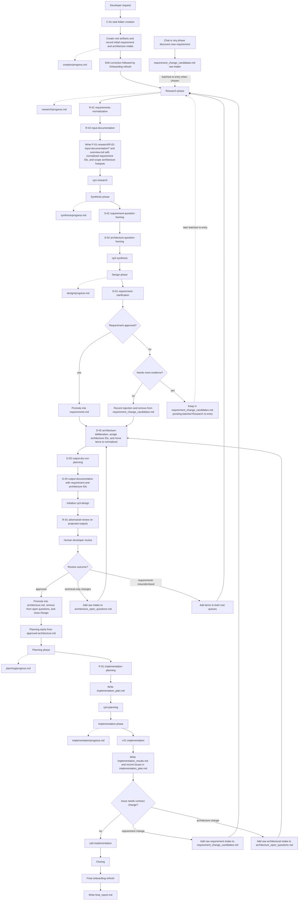

# Workflow Architecture

## Task Global Skill Inventory

| Skill Name                               | Description                                                                                                                                                                                                                                                                                                                                                                                                                                                                                                                                                                                                                                                                                                                                                        | TODOs |
| ---------------------------------------- | ------------------------------------------------------------------------------------------------------------------------------------------------------------------------------------------------------------------------------------------------------------------------------------------------------------------------------------------------------------------------------------------------------------------------------------------------------------------------------------------------------------------------------------------------------------------------------------------------------------------------------------------------------------------------------------------------------------------------------------------------------------------ | ----- |
| `W-01-heavy-task-workflow`               | Orchestrates the end-to-end heavy task workflow. The orchestrator is a workflow role that may be fulfilled by a dedicated orchestrator agent or by the developer-facing agent that accepted and initiated the workflow. That role stays in direct discussion with the developer, presents task-folder naming options during Creation, asks D-01 and D-02 questions one by one with explicit options or tradeoffs where helpful, waits for the developer's answer before continuing, writes and maintains the orchestrator-owned runtime documents (`task.md`, `requirements.md`, `architecture.md`, `requirement_change_candidates.md`, `architecture_open_questions.md`, and each phase `progress.md`), and coordinates phase transitions and checkpoint reviews. |       |
| `R-01-adversarial-review`                | Performs on every checkpoint adversarial reviews before the workflow moves forward.                                                                                                                                                                                                                                                                                                                                                                                                                                                                                                                                                                                                                                                                                |       |
| `C-02-onboarding-drift-detection`        | Detects and reports onboarding drift. Used in combination with `C-05-create-or-update-onboarding-files`. Especially for task start necessary to update existing onboarding files.                                                                                                                                                                                                                                                                                                                                                                                                                                                                                                                                                                                  |       |
| `C-05-create-or-update-onboarding-files` | Creates or updates onboarding files as needed. Needed at task start to amend drift. And during input documentation creation to create onboarding for undocumented code files before creating the input file.                                                                                                                                                                                                                                                                                                                                                                                                                                                                                                                                                       |       |
| `C-01-findings-capture`                  | Captures durable clarifications from chat or review. It can run inside a task or standalone. In standalone clarification it checks relevant code and onboarding first, asks questions if anything is unclear, and then records or routes the confirmed current-state finding into the appropriate durable path. If the finding changes requirements, the workflow re-enters the requirement pipeline instead of silently rewriting the contract.                                                                                                                                                                                                                                                                                                                   |       |

## Phase Local Skill Inventory

| Skill Name                           | Description                                                                                                                                                                                                                                                                                                                                                                                                                                                                           |
| ------------------------------------ | ------------------------------------------------------------------------------------------------------------------------------------------------------------------------------------------------------------------------------------------------------------------------------------------------------------------------------------------------------------------------------------------------------------------------------------------------------------------------------------- |
| `C-01-task-folder-creation`          | Presents task-folder naming options, creates the task folder, records initial requirements, and initializes the root task artifacts.                                                                                                                                                                                                                                                                                                                                                  |
| `R-01-requirements-normalization`    | Reads raw requirement candidates together with onboarding and code, then normalizes them into the normalized list in `requirement_change_candidates.md`.                                                                                                                                                                                                                                                                                                                              |
| `R-02-input-documentation`           | Uses normalized requirements & onboarding to investigate the codebase deeply and create or update task-local input documentation with requirement annotations. Purpose is to define scope and volume of the changes, question the normalized requirements for issues, and produce the Research handoff used downstream.                                                                                                                                                               |
| `S-01-requirement-question-framing`  | Compiles the requirement-facing elicitation questions from research findings and input documentation.                                                                                                                                                                                                                                                                                                                                                                                 |
| `S-02-architecture-question-framing` | Compiles the architectural questions and dependencies that Design must resolve: backend vs frontend ownership, layering, module boundaries, API shape, data model, sequencing, and integration strategy.                                                                                                                                                                                                                                                                              |
| `D-01-requirement-clarification`     | Asks the requirement-facing questions to the developer one by one, with explicit options where helpful, and waits for each answer so the developer can decide what should be true by the end of the task: scope, preserved behavior, constraints, success checks, non-goals, and assumptions that affect the contract. Promotes approved requirements into `requirements.md`, removes rejected candidates, and leaves evidence-pending candidates staged for later Research re-entry. |
| `D-02-architecture-deliberation`     | Asks the architectural how-do-we-do-it questions to the developer one by one after requirements are clarified, with explicit options and tradeoffs where helpful, and waits for each answer so the developer can choose direction on backend vs frontend ownership, layering, API and contract shape, data model, sequencing, integration direction, and the first assignment of architecture IDs.                                                                                    |
| `D-03-output-dry-run-planning`       | Plans the validation pass for the intended target-state outputs, including the corresponding onboarding references for every in-scope input file.                                                                                                                                                                                                                                                                                                                                     |
| `D-04-output-documentation`          | Produces the task-local target-state projection artifacts for the deliberated design direction. These outputs carry approved requirement IDs and architecture IDs, become the explicit CP3 stress-test surface, and use the corresponding onboarding references alongside task-local inputs for every mapped input file.                                                                                                                                                              |
| `P-01-implementation-planning`       | Reads `requirements.md`, `architecture.md`, the output documentation, and the relevant code, then produces the scheduling-only `implementation_plan.md`: dependency-ordered phases, checklist steps, verification notes, and an issues section used for planning-discovered problems. Does not introduce design content.                                                                                                                                                              |
| `I-01-implementation`                | Uses one Coder agent working sequentially from start to finish through the implementation plan. The Coder checks off completed steps in `implementation_plan.md`, records issues in the plan's issues section, and writes `implementation_results.md`. Discussion then resolves, discards, or turns issues into requirement or architecture intake.                                                                                                                                   |

## Artifacts Inventory

This inventory is the normalized comparison version. If adopted, it becomes the canonical contract for artifact names, locations, roles, and ownership.

| Artifact Name                    | Location                                           | Notes                                                                                                                                                                                                                                                                                                                                                                                                                                                                                                                                                                  | Contents                                                                                                                                                                                                                                                                                                                                                                 | Inputs                                                                                                                                                                                                                                                                                                                                                                                                                                                                                                           | Relevant Skills                                                                                                              |
| -------------------------------- | -------------------------------------------------- | ---------------------------------------------------------------------------------------------------------------------------------------------------------------------------------------------------------------------------------------------------------------------------------------------------------------------------------------------------------------------------------------------------------------------------------------------------------------------------------------------------------------------------------------------------------------------- | ------------------------------------------------------------------------------------------------------------------------------------------------------------------------------------------------------------------------------------------------------------------------------------------------------------------------------------------------------------------------ | ---------------------------------------------------------------------------------------------------------------------------------------------------------------------------------------------------------------------------------------------------------------------------------------------------------------------------------------------------------------------------------------------------------------------------------------------------------------------------------------------------------------- | ---------------------------------------------------------------------------------------------------------------------------- |
| task.md                          | root                                               | Global project-progress artifact. It observes the workflow from start to finish and does not hold the finalized requirements contract. Written solely by the orchestrator.                                                                                                                                                                                                                                                                                                                                                                                             | objective, developer notes, global phase tracker, execution order, links to phase artifacts, implementation status summary                                                                                                                                                                                                                                               | chat: initial raw requirements, P-XX-<phase>/progress.md, P-99-review/\*, requirement_change_candidates.md                                                                                                                                                                                                                                                                                                                                                                                                       | `C-01-task-folder-creation`, `W-01-heavy-task-workflow`                                                                      |
| requirements.md                  | root                                               | Canonical finalized requirements artifact. Approved items are promoted here only after `D-01-requirement-clarification` completes. Changes to already approved requirements must also re-enter staging and may not be edited here directly. Written solely by the orchestrator.                                                                                                                                                                                                                                                                                        | finalized and approved requirements with preserved requirement IDs                                                                                                                                                                                                                                                                                                       | requirement_change_candidates.md, P-03-design/D-01-requirement-clarification/requirement-clarification.md                                                                                                                                                                                                                                                                                                                                                                                                        | `D-01-requirement-clarification`, `W-01-heavy-task-workflow`                                                                 |
| architecture.md                  | root                                               | Canonical finalized architecture contract artifact. Approved architectural items are promoted here only after `D-02-architecture-deliberation` chooses direction, `D-04-output-documentation` projects it, and the explicit CP3 stress-test cycle passes. Changes to already approved architecture must also re-enter staging and may not be edited here directly. Written solely by the orchestrator.                                                                                                                                                                 | finalized and approved architectural decisions, boundaries, ownership, interfaces, chosen direction, and preserved architecture IDs                                                                                                                                                                                                                                      | architecture_open_questions.md, P-02-synthesis/S-02-architecture-question-framing/architecture-question-framing.md, requirements.md, P-03-design/D-02-architecture-deliberation/architecture-deliberation.md, P-03-design/D-04-output-documentation/, P-99-review/cp3-design.md                                                                                                                                                                                                                                  | `D-02-architecture-deliberation`, `D-04-output-documentation`, `R-01-adversarial-review`, `W-01-heavy-task-workflow`         |
| final_report.md                  | root                                               | Closeout artifact. Not used as a working artifact during earlier phases. Written after implementation approval and the final onboarding refresh.                                                                                                                                                                                                                                                                                                                                                                                                                       | final cross-phase summary of what was learned, decided, built, and updated in onboarding                                                                                                                                                                                                                                                                                 | requirements.md, architecture.md, P-01-research/R-02-input-documentation/, P-03-design/D-01-requirement-clarification/requirement-clarification.md, P-03-design/D-02-architecture-deliberation/architecture-deliberation.md, P-03-design/D-04-output-documentation/, P-04-planning/P-01-implementation-planning/implementation_plan.md, P-05-implementation/I-01-implementation/implementation_results.md, onboarding docs                                                                                       | `W-01-heavy-task-workflow`                                                                                                   |
| architecture_open_questions.md   | root                                               | Canonical architecture staging artifact. It carries task-start architectural intake, which may include explicit developer-directed target outcomes, plus research-scoped hotspots, unresolved architectural questions, post-review technical follow-up, and the normalized architecture entries that are waiting for final disposition. The orchestrator moves items through this file and removes them when they are promoted or rejected. It does not hold requirement questions, and it is not the final architecture contract. Written solely by the orchestrator. | raw-intake concerns, developer-directed target outcomes, proposed technical directions, scoped hotspots, unresolved architectural questions, technical evidence gaps, normalized architecture entries with architecture IDs, statuses, owners, and review feedback                                                                                                       | chat: initial architectural concerns or later technical feedback, P-01-research/R-02-input-documentation/, P-02-synthesis/S-02-architecture-question-framing/architecture-question-framing.md, P-03-design/D-01-requirement-clarification/requirement-clarification.md, P-03-design/D-02-architecture-deliberation/architecture-deliberation.md, P-99-review/cp3-design.md, P-04-planning/P-01-implementation-planning/implementation_plan.md, P-05-implementation/I-01-implementation/implementation_results.md | `W-01-heavy-task-workflow`                                                                                                   |
| requirement_change_candidates.md | root                                               | Staging artifact for requirement promotion and deferred follow-up. Approved items are promoted into `requirements.md`. Rejected items are removed after disposition is recorded. Candidates needing more evidence remain here until a later batched Research re-entry. Written solely by the orchestrator.                                                                                                                                                                                                                                                             | raw-intake list, normalized list, pending-evidence entries, evidence links, promotion status                                                                                                                                                                                                                                                                             | chat: initial raw requirements or later raw requirement messages, P-01-research/R-02-input-documentation/, P-03-design/D-01-requirement-clarification/requirement-clarification.md, P-03-design/D-02-architecture-deliberation/architecture-deliberation.md, P-04-planning/P-01-implementation-planning/implementation_plan.md, P-05-implementation/I-01-implementation/implementation_results.md                                                                                                                | `C-01-task-folder-creation`, `R-01-requirements-normalization`, `D-01-requirement-clarification`, `W-01-heavy-task-workflow` |
| progress.md                      | P-XX-<phase>/                                      | Written and maintained solely by the orchestrator, which tracks progress and documents done steps.                                                                                                                                                                                                                                                                                                                                                                                                                                                                     | phase specific tracking                                                                                                                                                                                                                                                                                                                                                  | -                                                                                                                                                                                                                                                                                                                                                                                                                                                                                                                | `W-01-heavy-task-workflow`                                                                                                   |
| </path/code_file_name>.md        | P-01-research/R-02-input-documentation/            | Canonical present-state task-local input documentation file.                                                                                                                                                                                                                                                                                                                                                                                                                                                                                                           | current-state input documentation for a relevant path or area with normalized requirement IDs, task annotations, evidence, boundaries, and behavior notes.                                                                                                                                                                                                               | requirement_change_candidates.md, requirements.md, `<onboarding-root>/`, code                                                                                                                                                                                                                                                                                                                                                                                                                                    | `R-02-input-documentation`                                                                                                   |
| overview.md                      | P-01-research/R-02-input-documentation/            | Canonical present-state overview artifact for Research and Synthesis.                                                                                                                                                                                                                                                                                                                                                                                                                                                                                                  | scope-level overview of relevant areas, cross-file interactions, flows, authority boundaries, open tensions, and normalized requirement ID coverage                                                                                                                                                                                                                      | P-01-research/R-02-input-documentation/\*.md, requirement_change_candidates.md, requirements.md                                                                                                                                                                                                                                                                                                                                                                                                                  | `R-02-input-documentation`                                                                                                   |
| requirement-question-framing.md  | P-02-synthesis/S-01-requirement-question-framing/  | First synthesis subphase output. Feeds S-02 and later D-01.                                                                                                                                                                                                                                                                                                                                                                                                                                                                                                            | cleaned, ordered what-should-be-true requirement questions, contract-affecting tensions, and elicitation targets                                                                                                                                                                                                                                                         | P-01-research/R-02-input-documentation/, requirement_change_candidates.md, requirements.md                                                                                                                                                                                                                                                                                                                                                                                                                       | `S-01-requirement-question-framing`                                                                                          |
| architecture-question-framing.md | P-02-synthesis/S-02-architecture-question-framing/ | Second synthesis subphase output. Feeds D-02 primarily. Together with `requirement-question-framing.md` it carries the synthesis handoff into Design, but its job is specifically to frame architectural uncertainty. It does not assign architecture IDs yet.                                                                                                                                                                                                                                                                                                         | architectural questions, dependency order, decision gaps, evidence gaps, and briefing for Design                                                                                                                                                                                                                                                                         | P-02-synthesis/S-01-requirement-question-framing/requirement-question-framing.md, P-01-research/R-02-input-documentation/, architecture_open_questions.md, requirements.md                                                                                                                                                                                                                                                                                                                                       | `S-02-architecture-question-framing`                                                                                         |
| requirement-clarification.md     | P-03-design/D-01-requirement-clarification/        | First Design step. It presents what should be true by the end of the task to the developer one question at a time before architectural choices are finalized. The agent may frame options, but the answers come from the developer. Approved requirements are promoted from `requirement_change_candidates.md` into `requirements.md` here. Rejected candidates are removed after disposition is recorded. Evidence-pending candidates stay staged for later batched Research re-entry.                                                                                | developer-answered clarifications about scope, preserved behavior, constraints, success checks, non-goals, promotion-ready updates, rejection rationales, and pending-evidence items queued for later Research re-entry                                                                                                                                                  | P-02-synthesis/S-01-requirement-question-framing/requirement-question-framing.md, requirement_change_candidates.md, requirements.md, P-01-research/R-02-input-documentation/                                                                                                                                                                                                                                                                                                                                     | `D-01-requirement-clarification`                                                                                             |
| architecture-deliberation.md     | P-03-design/D-02-architecture-deliberation/        | Main architecture deliberation artifact inside Design. Must not quietly rewrite the contract. It presents architectural how-do-we-do-it uncertainty to the developer one question at a time after D-01 settles what must be true. The agent may frame options and tradeoffs, but the answers come from the developer.                                                                                                                                                                                                                                                  | developer-chosen architectural options, tradeoffs, backend vs frontend ownership, layering, API and contract shape, data model, sequencing, chosen direction, rejected directions, rationale, and assigned architecture IDs                                                                                                                                              | P-03-design/D-01-requirement-clarification/requirement-clarification.md, P-02-synthesis/S-02-architecture-question-framing/architecture-question-framing.md, requirements.md, P-01-research/R-02-input-documentation/, architecture_open_questions.md                                                                                                                                                                                                                                                            | `D-02-architecture-deliberation`                                                                                             |
| output-dry-run-planning.md       | P-03-design/D-03-output-dry-run-planning/          | Bridges architecture deliberation into output documentation.                                                                                                                                                                                                                                                                                                                                                                                                                                                                                                           | dry-run plan for validating intended outputs and target-state expectations                                                                                                                                                                                                                                                                                               | P-03-design/D-02-architecture-deliberation/architecture-deliberation.md, P-03-design/D-01-requirement-clarification/requirement-clarification.md, requirements.md, the corresponding onboarding references for every in-scope input documentation file                                                                                                                                                                                                                                                           | `D-03-output-dry-run-planning`                                                                                               |
| </path/code_file_name>.md        | P-03-design/D-04-output-documentation/             | Canonical target-state task-local output documentation file. Separate from the input documentation layer.                                                                                                                                                                                                                                                                                                                                                                                                                                                              | target-state output documentation for the intended future state of a relevant path or area, carrying approved requirement IDs and architecture IDs, short plain-language summaries for those requirements, and representative projected code examples for the distinct change types in that slice. Files in areas are mapped 1-1 with inputs                             | P-03-design/D-03-output-dry-run-planning/output-dry-run-planning.md, P-03-design/D-02-architecture-deliberation/architecture-deliberation.md, P-03-design/D-01-requirement-clarification/requirement-clarification.md, requirements.md, P-01-research/R-02-input-documentation/, the corresponding onboarding references for every mapped input documentation file                                                                                                                                               | `D-04-output-documentation`                                                                                                  |
| overview.md                      | P-03-design/D-04-output-documentation/             | Canonical target-state overview artifact.                                                                                                                                                                                                                                                                                                                                                                                                                                                                                                                              | scope-level target-state overview, cross-file interactions, responsibilities, intended outcomes, requirement and architecture summaries with one or more file links each, and an index of representative examples available for Planning to pull                                                                                                                         | P-03-design/D-04-output-documentation/\*.md, P-03-design/D-02-architecture-deliberation/architecture-deliberation.md, requirements.md, the corresponding onboarding references for every mapped input documentation file                                                                                                                                                                                                                                                                                         | `D-04-output-documentation`                                                                                                  |
| implementation_plan.md           | P-04-planning/P-01-implementation-planning/        | Scheduling artifact only. Substantive design or contract content belongs in `D-04-output-documentation/`, `architecture.md`, or `requirements.md`. Anything beyond dependency ordering, checklist definition, verification, issue tracking, and quoting approved `D-04` examples must be rejected at CP4. Issues found during planning or implementation are discussed first and only later, if approved, may become requirement or architecture intake.                                                                                                               | scheduling-only plan: scope summary, feature and architectural requirements with traceable text, dependency-ordered implementation steps with checkbox substeps and verification notes, representative code examples pulled from `D-04-output-documentation/`, plus an issues section for problems found during planning or implementation and their discussion outcomes | requirements.md, architecture.md, P-03-design/D-04-output-documentation/, P-03-design/D-02-architecture-deliberation/architecture-deliberation.md, relevant code                                                                                                                                                                                                                                                                                                                                                 | `P-01-implementation-planning`, `I-01-implementation`                                                                        |
| implementation_results.md        | P-05-implementation/I-01-implementation/           | Implementation handoff into Closing. It summarizes the completed sequential execution, verification results, deviations, and issue dispositions. Requirement or architecture intake is created only if discussion explicitly decides an issue should be promoted into the appropriate staging artifact.                                                                                                                                                                                                                                                                | per-phase and per-step summary of files changed, interfaces introduced, deviations from the plan or output documentation, verification results, deferred follow-ups, and issue dispositions                                                                                                                                                                              | P-04-planning/P-01-implementation-planning/implementation_plan.md, requirements.md, architecture.md, P-03-design/D-04-output-documentation/, code (post-change), P-05-implementation/progress.md                                                                                                                                                                                                                                                                                                                 | `I-01-implementation`                                                                                                        |
| cp1-research.md                  | P-99-review/                                       | Checkpoint review artifact. Review-only. No new working artifacts are generated here.                                                                                                                                                                                                                                                                                                                                                                                                                                                                                  | adversarial review findings, human review outcome, and checkpoint disposition                                                                                                                                                                                                                                                                                            | P-01-research/R-02-input-documentation/, requirement_change_candidates.md                                                                                                                                                                                                                                                                                                                                                                                                                                        | `R-01-adversarial-review`                                                                                                    |
| cp2-synthesis.md                 | P-99-review/                                       | Checkpoint review artifact for Synthesis outputs.                                                                                                                                                                                                                                                                                                                                                                                                                                                                                                                      | adversarial review findings, human review outcome, and checkpoint disposition                                                                                                                                                                                                                                                                                            | P-01-research/R-02-input-documentation/, P-02-synthesis/S-01-requirement-question-framing/requirement-question-framing.md, P-02-synthesis/S-02-architecture-question-framing/architecture-question-framing.md, requirement_change_candidates.md, requirements.md                                                                                                                                                                                                                                                 | `R-01-adversarial-review`                                                                                                    |
| cp3-design.md                    | P-99-review/                                       | Checkpoint review artifact for Design outputs.                                                                                                                                                                                                                                                                                                                                                                                                                                                                                                                         | adversarial review findings, human review outcome, and checkpoint disposition                                                                                                                                                                                                                                                                                            | P-03-design/D-01-requirement-clarification/requirement-clarification.md, P-03-design/D-02-architecture-deliberation/architecture-deliberation.md, P-03-design/D-03-output-dry-run-planning/output-dry-run-planning.md, P-03-design/D-04-output-documentation/, requirements.md, requirement_change_candidates.md                                                                                                                                                                                                 | `R-01-adversarial-review`                                                                                                    |
| cp4-planning.md                  | P-99-review/                                       | Checkpoint review artifact for Planning. Verifies the plan adds nothing beyond dependency ordering, checklist step definition, and verification, and that every output documentation file is scheduled.                                                                                                                                                                                                                                                                                                                                                                | adversarial review findings, human review outcome, and checkpoint disposition                                                                                                                                                                                                                                                                                            | P-04-planning/P-01-implementation-planning/implementation_plan.md, requirements.md, architecture.md, P-03-design/D-04-output-documentation/, P-03-design/D-02-architecture-deliberation/architecture-deliberation.md                                                                                                                                                                                                                                                                                             | `R-01-adversarial-review`                                                                                                    |
| cp5-implementation.md            | P-99-review/                                       | Checkpoint review artifact for Implementation. Verifies code matches `D-04-output-documentation/` and that deviations are honestly recorded.                                                                                                                                                                                                                                                                                                                                                                                                                           | adversarial review findings, human review outcome, and checkpoint disposition                                                                                                                                                                                                                                                                                            | P-05-implementation/I-01-implementation/implementation_results.md, P-04-planning/P-01-implementation-planning/implementation_plan.md, requirements.md, architecture.md, P-03-design/D-04-output-documentation/, code diff                                                                                                                                                                                                                                                                                        | `R-01-adversarial-review`                                                                                                    |

### Proposed Inventory Rules

1. Artifact names in this inventory are canonical. Similar or shortened names in other documents are drift.
2. Artifact locations are task-relative runtime locations, not template locations and not skill locations.
3. Checkpoints produce review artifacts only. They review completed phase outputs and do not generate new working artifacts.
4. `task.md` tracks global task progress. `requirement_change_candidates.md` stages requirements from `raw-intake` to `normalized`. `requirements.md` holds finalized and approved requirements. `architecture_open_questions.md` stages architecture from `raw-intake` to `normalized` after `D-02-architecture-deliberation`. `architecture.md` holds finalized and approved architecture. Changes to already approved requirement or architecture items must re-enter their staging artifacts and may not bypass them.
5. `architecture_open_questions.md` is the architecture staging queue for raw intake, research-scoped hotspots, unresolved architectural questions, technical evidence gaps, normalized architecture entries awaiting disposition, and post-review technical feedback. `architecture-question-framing.md` is the phase artifact that feeds Design and never replaces this queue. `architecture.md` is the approved architecture contract and is updated only after projection and the explicit CP3 stress-test cycle. Requirement-side uncertainty stays in the requirement pipeline instead of routing through this file.
6. The input documentation layer (`P-01-research/R-02-input-documentation/`) and the output documentation layer (`P-03-design/D-04-output-documentation/`) are separate truth layers and must not be collapsed into one artifact family. Inputs map relevant code 1-to-1 and track normalized requirement IDs. Outputs map intended code-state 1-to-1 on a per file basis and track approved requirement IDs plus architecture IDs. Overviews cover the scope-level context.
7. Requirement promotion follows one repeatable cycle: `raw-intake -> normalization -> research questioning -> synthesis framing -> requirement clarification -> approved promotion into requirements.md`.
8. Research hands off through `P-01-research/R-02-input-documentation/overview.md` and its companion input documentation files. Separate research summary artifacts are drift.
9. Rejected candidates are removed from `requirement_change_candidates.md` after their disposition is recorded. Candidates needing more evidence remain staged there until a later batched Research re-entry.
10. Locations follow the canonical scheme `P-XX-<phase>/X-YY-<subphase>/`. Artifacts live directly in their owning subphase folder. No additional nesting (e.g. a `output-project-documentation/` subfolder under `D-04-output-documentation/`) is permitted.
11. Checkpoint reviews live in `P-99-review/cp<N>-<phase>.md`. Each phase from Research onward has exactly one checkpoint review artifact. Closing has no checkpoint review for MVP.
12. The implementation plan is a scheduling artifact. Substantive design or contract content belongs in `D-04-output-documentation/`, `architecture.md`, or `requirements.md` and must be rejected at CP4 if it appears in the plan.
13. The framing files in `S-01-requirement-question-framing/` and `S-02-architecture-question-framing/` are the synthesis handoff into Design: `S-01` frames what should be true by the end of the task, `S-02` frames the architectural how-do-we-do-it questions.
14. Architecture promotion follows an explicit cycle: `raw-intake -> research scoping -> architecture question framing -> D-02 architecture deliberation -> D-03/D-04 projection -> explicit CP3 stress test -> approved promotion into architecture.md`.
15. Canonical architecture IDs begin at `D-02-architecture-deliberation`. `architecture_open_questions.md` and `architecture-question-framing.md` feed that step but do not assign those IDs.
16. `P-03-design/D-04-output-documentation/overview.md` must aggregate traceability tables for all approved requirement IDs and all architecture IDs, each with one or more file links showing where that ID appears.
17. Architecture items move through orchestrator-owned destructive transitions: `raw-intake -> normalized -> promoted/rejected`. When an item moves, it is removed from its old position. After current architecture items have been promoted into `architecture.md` or rejected, `architecture_open_questions.md` should be empty.
18. The orchestrator is a workflow role in direct discussion with the developer. That role may be fulfilled by a dedicated orchestrator agent or by the developer-facing agent that accepted and initiated the workflow. It is the sole writer of `task.md`, `requirements.md`, `architecture.md`, `requirement_change_candidates.md`, `architecture_open_questions.md`, and each phase `progress.md`. Skill-owned artifacts may be written by their owning skills unless the orchestrator explicitly consolidates or rewrites them.

## Tandem Development Model

Requirements and architecture are developed in tandem because they are co-dependent, but they do not harden at the same time.

Requirements define what should be true by the end of the task.

Architecture defines how that truth is carried through the system technically.

The workflow has to work both lanes in parallel because Research cannot understand scope, likely hotspots, or the quantity and quality of change from requirements alone. At the same time, the workflow cannot safely commit to concrete architecture before requirements settle, because that would harden technical direction against an unstable contract.

### Why Parallel Lanes Matter

Parallel laning matters because it solves two problems at once:

1. it gives Research early architectural awareness so it can pull the right onboarding and understand likely blast radius
2. it prevents the workflow from committing to concrete technical solutions before `D-01-requirement-clarification` records the developer-approved requirements

This keeps the workflow technically aware without letting it become prematurely concrete.

### Why Inputs Make It Possible

The input documentation layer is what makes the early tandem work possible.

`P-01-research/R-02-input-documentation/` freezes current-state truth.

It also freezes the normalized requirement ID view for that current-state surface.

That gives both lanes the same evidence base:

1. the requirement lane can test whether the intended contract actually matches the current system
2. the architecture lane can identify where change is likely to land, which seams matter, and what rough direction seems plausible

Without the input layer, the workflow would either guess too much or discover architectural scope too late.

### Why Outputs Make Approval Possible

The output documentation layer is what makes architectural approval possible.

`D-02-architecture-deliberation` records the developer's chosen concrete direction, but that direction is not approved yet.

That is also the first point where canonical architecture IDs exist.

`D-03-output-dry-run-planning` and `D-04-output-documentation` project that direction into intended code structure, intended behavior, and intended intent.

That projection uses the task-local input documentation together with the corresponding onboarding references for every in-scope input file.

Those output artifacts carry approved requirement IDs and architecture IDs, while the output `overview.md` aggregates both into traceability tables with one or more file links per ID.

That projected package is the seam that marries requirements and architecture. It shows whether the chosen architecture can actually carry the approved intent.

It is also the package that Planning later consumes when it turns approved intent into dependency-ordered implementation phases and checklist steps.

### Why Stress Testing Is Explicit

The architecture stress test is not implicit.

After `D-04-output-documentation` finishes, the design phase stops producing working artifacts and explicitly initializes `cp3-design.md`.

The stress-test cycle has three steps:

1. projection through the output documentation layer
2. adversarial agent review of the projected result
3. human developer feedback on the projected hotspots, behavior, and intent

Only after that cycle passes can approved architectural items be promoted into `architecture.md`.

### Why The Correction Loops Split

The correction loops split by failure type.

1. if review feedback remains purely technical, record it in `architecture_open_questions.md` raw-intake and jump back to `D-02-architecture-deliberation`
2. if review feedback shows the requirements were not properly understood, record requirement items in `requirement_change_candidates.md`, record architectural items in `architecture_open_questions.md`, and jump back to Research

This keeps the workflow fast when the problem is only technical and thorough when the contract itself is wrong.

 
 

---

## Workflow Description & Flow Diagram

### Workflow Description

The workflow separates project tracking from requirement promotion and architecture approval.

`task.md` tracks the task globally across phases. It records the objective, developer notes, global progress, execution order, and links to the artifacts created during the workflow. It does not serve as the approved requirements contract.

The orchestrator is the workflow controller role in direct discussion with the developer. That role may be fulfilled by a dedicated orchestrator agent or by the developer-facing agent that accepted and initiated the workflow. It solely writes and maintains `task.md`, `requirements.md`, `architecture.md`, `requirement_change_candidates.md`, `architecture_open_questions.md`, and each phase `progress.md`.

`requirement_change_candidates.md` is the staging artifact for requirement work. It accepts raw requirement intake at any phase, including the initial developer prompt and later discoveries made during research, synthesis, design, planning, or implementation. New requirement material enters this file as `raw-intake` and does not skip directly into `requirements.md`. Proposed changes to already approved requirements also re-enter this file as staging work and are not applied directly in `requirements.md`.

`requirements.md` is the approved requirements contract. New or changed requirements are promoted into it only after they have completed the repeatable promotion cycle and passed through `D-01-requirement-clarification`. The orchestrator performs those moves into `requirements.md`.

`architecture_open_questions.md` is the architecture staging queue. It accepts task-start architectural intake, which may already include explicit developer-directed target outcomes, plus research-scoped hotspots, technical evidence gaps, and later technical review feedback. It also accepts proposed changes to already approved architecture. The orchestrator moves architecture items through raw-intake and normalized states here, and removes them when they are promoted or rejected. It does not hold requirement questions.

`architecture.md` is the approved architecture contract. New or changed architecture is promoted into it only after `D-02-architecture-deliberation` records the developer's chosen direction and assigns architecture IDs, `D-03-output-dry-run-planning` and `D-04-output-documentation` project that direction, `cp3-design.md` is initialized explicitly, adversarial review runs, and the human developer approves the projected result. The orchestrator performs those moves into `architecture.md`.

Skill-owned artifacts such as framing docs, deliberation records, output documentation, and other skill outputs may be written by their owning skills. Those artifacts do not replace the orchestrator-owned contract, staging, and progress documents.

That promotion is part of closing the Design phase. Planning starts only after the orchestrator has written the approved architectural items into `architecture.md`.

### Creation

Creation establishes the task and completes the onboarding refresh.

Creation:

1. presents task-folder naming options and waits for the developer to choose a branch-based, suggested, or custom name
2. creates the task folder and `task.md`
3. records initial raw requirements in `requirement_change_candidates.md`
4. records initial architectural intake in `architecture_open_questions.md`, including any explicit developer-provided target direction
5. refreshes and validates onboarding context

Creation ends once onboarding is complete enough for Research to start. It does not own requirement normalization anymore.

### Research

Research starts the repeatable requirement-promotion cycle and the early architecture-scoping loop.

Research consists of two ordered skills:

1. `R-01-requirements-normalization`
2. `R-02-input-documentation`

At the start of Research:

1. `R-01-requirements-normalization` reads raw requirement candidates together with onboarding and code
2. raw requirements in `requirement_change_candidates.md` are normalized into the file's normalized list
3. normalized entries are removed from the raw-intake list once promoted into the normalized list
4. `R-02-input-documentation` uses the normalized requirements directly to investigate the current system more deeply and to scope likely architectural hotspots and rough direction

Research then pressure-tests the normalized requirements against onboarding and code through `P-01-research/R-02-input-documentation/`. In parallel, it records architectural hotspots and technical evidence gaps in `architecture_open_questions.md`. Normalized requirement IDs appear in the relevant input documentation files and in `overview.md`. Those files are the Research handoff into Synthesis and later phases. Research does not produce a separate summary artifact.

### Synthesis

Synthesis turns research findings into two different question sets: requirement-facing questions about what should be true by the end of the task, and architectural questions about how to do it.

Synthesis:

1. reads `P-01-research/R-02-input-documentation/`, especially `overview.md` and the relevant input documentation files
2. compiles requirement-facing elicitation questions in `P-02-synthesis/S-01-requirement-question-framing/requirement-question-framing.md`
3. compiles architectural questions in `P-02-synthesis/S-02-architecture-question-framing/architecture-question-framing.md` using `architecture_open_questions.md` plus the Research handoff

The two framing files together are the synthesis handoff into Design. `requirement-question-framing.md` defines the what-should-be-true questions that D-01 must settle. `architecture-question-framing.md` defines the architectural how-do-we-do-it questions that D-02 must settle. It still does not assign architecture IDs.

This stage does not approve requirements. It prepares the question set that Design must resolve.

### Design

Design begins with requirement resolution before architecture deliberation.

`D-01-requirement-clarification`:

1. asks the what-should-be-true requirement questions assembled by Synthesis to the developer one by one and waits for each answer
2. offers explicit options where that helps the developer choose cleanly
3. records the developer's answers in `P-03-design/D-01-requirement-clarification/requirement-clarification.md`
4. identifies which normalized requirement candidates are ready for approval
5. promotes approved items from `requirement_change_candidates.md` into `requirements.md`
6. records rejected candidates in `P-03-design/D-01-requirement-clarification/requirement-clarification.md` and then removes them from `requirement_change_candidates.md`
7. keeps candidates that still need more evidence in `requirement_change_candidates.md` for a later batched Research re-entry

After `D-01-requirement-clarification`, the workflow continues through `D-02-architecture-deliberation`, `D-03-output-dry-run-planning`, and `D-04-output-documentation` using the approved contract in `requirements.md`. `D-02-architecture-deliberation` is where the workflow asks the architecture-facing questions to the developer one by one, with explicit options and tradeoffs where helpful, and waits for each answer so the developer can choose concrete architectural direction: backend vs frontend ownership, layering, API and contract shape, data model, sequencing, and integration direction. It is also where canonical architecture IDs are first assigned once that chosen direction is recorded. At that point, the orchestrator moves resolved architecture items out of the raw-intake section of `architecture_open_questions.md` and into its normalized section, deleting the old raw-intake entries. `D-03-output-dry-run-planning` and `D-04-output-documentation` then project that direction into target-state outputs and intended behavior using the task-local input documentation together with the corresponding onboarding references for every in-scope input file. Those output artifacts carry approved requirement IDs and architecture IDs, and the output `overview.md` aggregates both into traceability tables with one or more file links per ID. Once the output files are created, the design phase explicitly initializes `cp3-design.md`, runs adversarial review, and then waits for human developer feedback. If that full stress-test cycle passes, the orchestrator promotes the approved architectural items into `architecture.md` as the final Design action and removes them from `architecture_open_questions.md`. Design is complete only after that promotion, and Planning starts from the updated approved architecture contract.

### Re-entry Rule

Raw requirement intake and raw architectural intake can happen at any phase.

Promotion cannot happen at any phase.

Requirement items accumulate in `requirement_change_candidates.md`. Architectural items accumulate in the raw-intake section of `architecture_open_questions.md` until `D-02-architecture-deliberation` normalizes them.

The correction loop depends on what kind of problem was discovered:

1. if the issue is still purely technical, add it to `architecture_open_questions.md` raw-intake, jump back to `D-02-architecture-deliberation`, then re-run `D-03-output-dry-run-planning`, `D-04-output-documentation`, and the explicit `cp3-design.md` stress-test cycle
2. if the issue shows the requirements were not properly understood, add requirement items to `requirement_change_candidates.md`, add architectural items to `architecture_open_questions.md`, and jump back to the start of Research

The full tandem-lane restart re-runs the same sequence:

1. normalize requirement raw intake
2. re-run input documentation against the updated requirement and architecture queues
3. re-run synthesis
4. re-run `D-01-requirement-clarification`
5. re-run `D-02-architecture-deliberation`
6. re-run output projection and the explicit `cp3-design.md` stress-test cycle

This keeps purely technical corrections fast while still supporting a full restart when the contract itself was misunderstood.

### Flow Diagram

